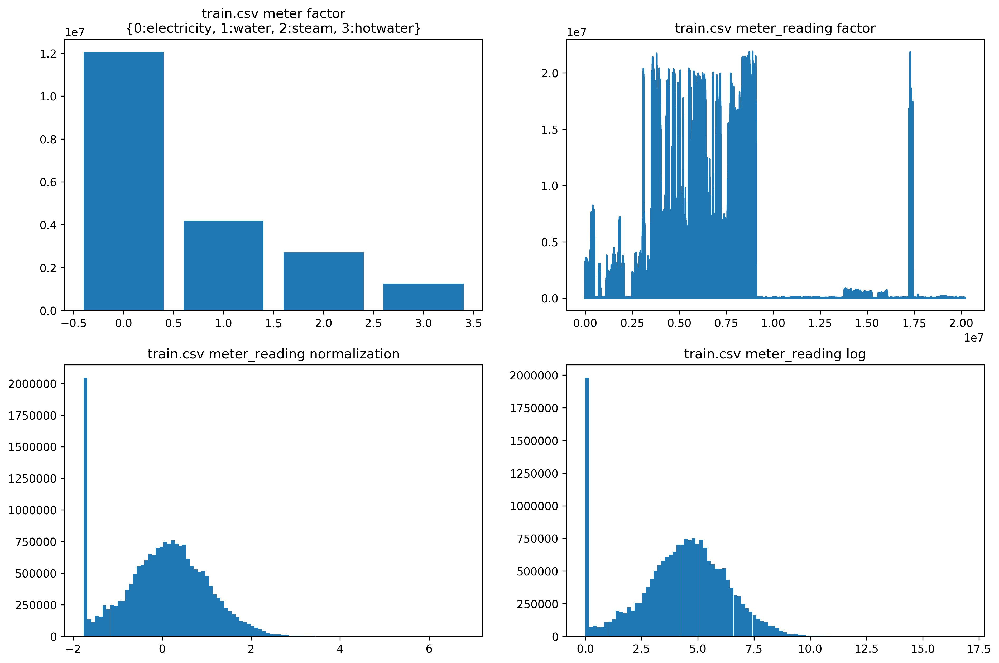
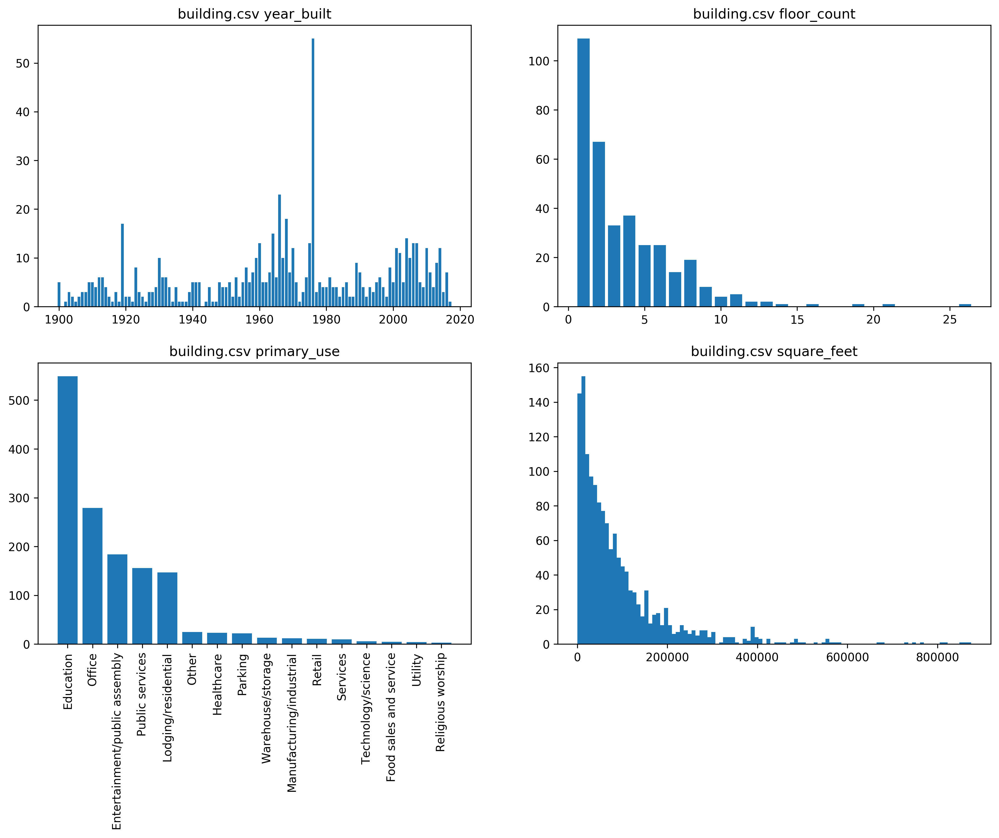
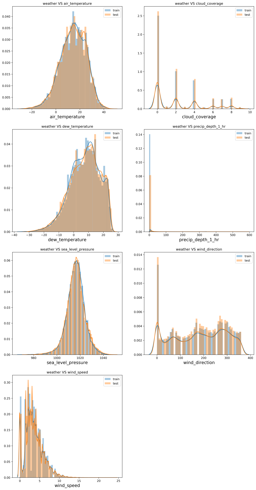
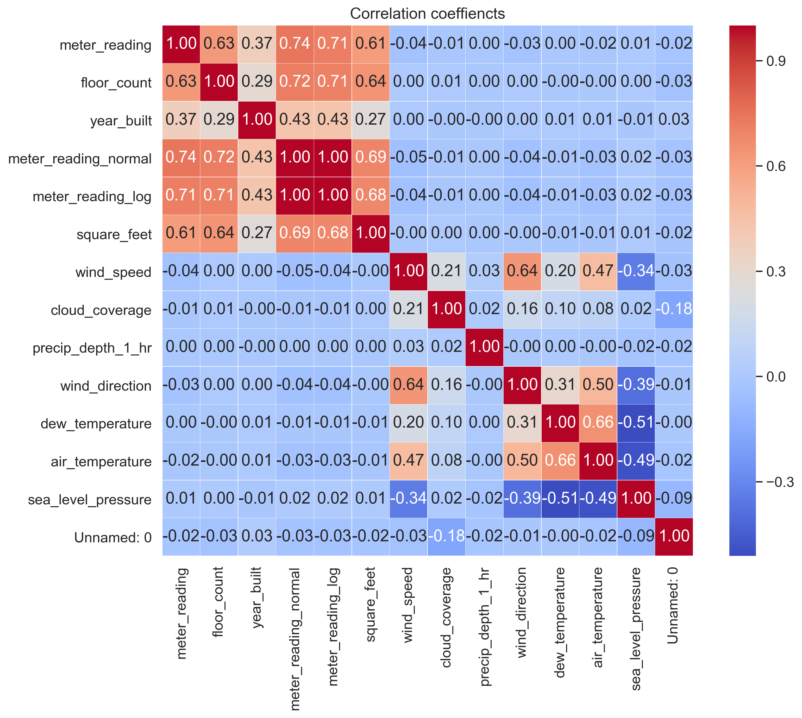
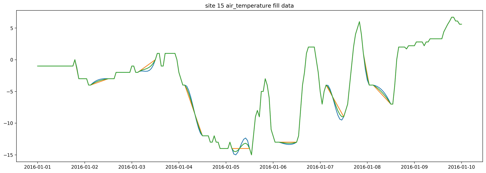

# ASHRAE - Great Energy Predictor III Final Score: 8th/3595

## Key information in the resources csv files

There are 6 csv files: 'train.csv', 'building_metadata.csv', 'weather_test.csv', 'weather_train.csv', 'test.csv', 'sample_submission.csv'

1. train.csv

    building_id - Foreign key for the building metadata.

    meter - The meter id code. Read as {0: electricity, 1: chilledwater, 2: steam, hotwater: 3}. Not every building has all meter types.

    timestamp - When the measurement was taken.

    meter_reading - The target variable. Energy consumption in kWh (or equivalent). Note that this is real data with measurement error, which we expect will impose a baseline level of modeling error. 

2. building_meta.csv

    site_id - Foreign key for the weather files.

    building_id - Foreign key for training.csv

    primary_use - Indicator of the primary category of activities for the building based on EnergyStar property type definitions

3. weather(train/test).csv 

    site_id

    air_temperature - Degrees Celsius

    cloud_coverage - Portion of the sky covered in clouds, in oktas

    dew_temperature - Degrees Celsius

4. test.csv

The submission files use row numbers for ID codes in order to save space on the file uploads. test.csv has no feature data; it exists so you can get your predictions into the correct order.

row_id - Row id for your submission file

building_id - Building id code

meter - The meter id code

timestamp - Timestamps for the test data period

5. sample_submission.csv

A valid sample submission.

## Pre-process the data

1. Change the timestamp to a format: '%Y-%m-%d %H:%M:%S' which can be compared

2. reduce the memory by change int to int16 and float to float 16

3. final predictor 'meter_reading' has a right-tailed distribution, therefore use log to normalize.

4. merged the csv by building_id, site_id and timestamp

## visualize the important information

1. check the factors (meter and meter_reading) in train.csv, and check power_transform and log of meter_reading

2. check the factors in building.csv: ('year_built', 'floor_count', 'primary_use', 'square_feet')

3. compare weather(train and test).csv for different factors: 
('air_temperature', 'cloud_coverage', 'dew_temperature', 'precip_depth_1_hr', 'sea_level_pressure', 'wind_direction', 'wind_speed')

4. get the correlation_heatmap for all potential factors

5. check timescales changing of meter_reading in different buildings:

figures are too large so not showing here.

* random building in certain types of primary use in whole period: 2016

* random building in certain types of primary use in certain month: Auguest

* random building in certain types of primary use in certain day: 10-01

* mean meter_reading in certain types of primary use in whole period: 2016

* mean meter_reading in certain types of primary use in certain month: Auguest

* mean meter_reading in certain types of primary use in certain day: 10-01

6. scrapping in the website (https://www.oeis.ucf.edu/buildings)

## data cleaning

1. weather_(train/test).csv cleaning:

   (not sugguestion based on the rmse and learderboard score)

* use 3 different ways of interpolation to fill in the data (polynomial, linear, both (mixture))

   (Best way to fill based on the rmse and learderboard score)

* group the weather with day and month and site_id and fill in the missing value with the mean because for each day the weather will not have a strong difference and air_temperature has small amount of missing values.

2. drop the outlier

   (key part for reduction of rmse and lb)

# initial cleanup
* 141 days of electricity for site 0: Most would be covered by the previous sets, but there are a few stray non-zero values that we ignore because they don't fit the overall pattern.

* Abnormally high readings from building 1099: These values are just absurdly high and don't fit an established pattern.

# second cleanup

https://www.kaggle.com/kernels/scriptcontent/24052407/download

* More than 48 hours with zero readings which do not occur during the typical seasons

* There's no reason for a building to ever have zero electrical usage

3. feature engineering

* site_0 meter 1 unit need to be changed and changed back before submission

* Add month, hour, weekday, relative_humidity, feels_like.

* logarithm for meter_reading and squared_feet.

* encode categorical data: primary_use.

* categorical features: building_id, site_id, primary_use, meter, dayofweek. Decided by rmse and lb.

4. feature usage

2 types of data were performed:

* initial cleanup features are building_id, site_id, air_temperature, dew_temperature, hour, sqare_feet, cloud_coverage, meter, weekend, precip_depth_1_hr and primary_use

* In final best cleanup data, features are added: sea_level_pressure, relative_humidity, wild_direction, feels_like, year)built, floor_count

## single model fit

1. Light GBM

    LightGBM is a gradient boosting framework that uses tree based learning algorithms. 

* initial cleanup without site_0 change, kfold = 3, lb is 1.086

* initial cleanup with initial features, kfold = 3, lb is 1.089

* initial cleanup with initial features, kfold = 2, lb is 1.089

* final cleanup with initial features, kfold = 3, lb is 1.086

* final cleanup with initial features, kfold = 2, lb is 1.092

* final cleanup with final features, kfold = 3, lb is 1.082

* final cleanup with final features, kfold = 5, lb is 1.074

* final cleanup with final features plus month, kfold = 5, lb is 1.078

2. XGBoost

    XGBoost is an optimized distributed gradient boosting library designed to be highly efficient, flexible and portable. 

* initial cleanup with initial features, kfold = 3, lb is 1.140

* final cleanup with initial features with bayes opt, kfold = 3, lb is 1.141

* final cleanup with final features, kfold = 5, lb is 1.084

* final cleanup with final features plus month, kfold = 5, lb is 1.087

3. CatBoost

    CatBoost is a high-performance open source library for gradient boosting on decision trees.

* initial cleanup with initial features, kfold = 3, lb is 1.100

* final cleanup with initial features with bayes opt, kfold = 3, lb is 1.099 (Caused by limited running iterations)

* final cleanup with initial features, kfold = 3, lb is 1.082

* final cleanup with final features, kfold = 5, lb is 1.074

4. Neural network

    Neural networks are a set of algorithms, modeled loosely after the human brain, that are designed to recognize patterns.

* initial cleanup with initial features, lb is 1.138

* final cleanup with initial features, lb is 1.100

## Blending model based on leaking data

    6 submission were used to fit leaking data for final: 3 lgb data, 1 nn, 1 cat, 1 xgb

* gradient ensemble by tensorflow to fit leaking data. (Not a good way, because the weight could be negative) lb = 0.966 with leaking data

* 6 0.0~0.5 float elements list were generated randomly to weight submissions to fit the leaking data. (Not fitting well) lb = 0.967

* PSO (Particle swarm optimization) is the best way. Best lb = 0.946 (Top 2% 62/3669)

* average all these 6 submission and get Top 1% 8th/3595